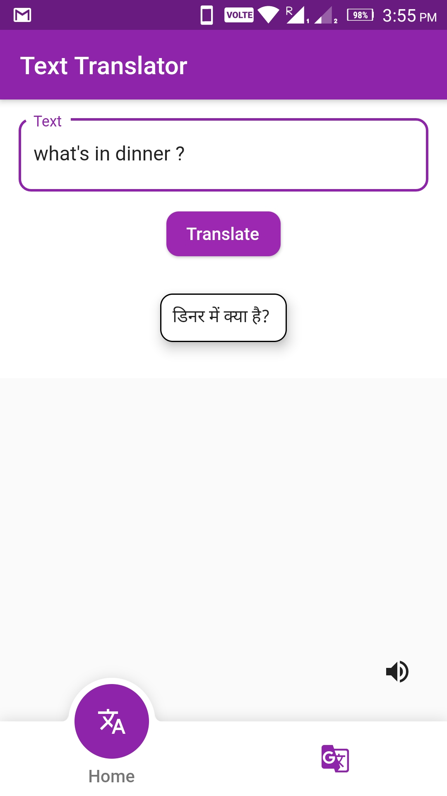
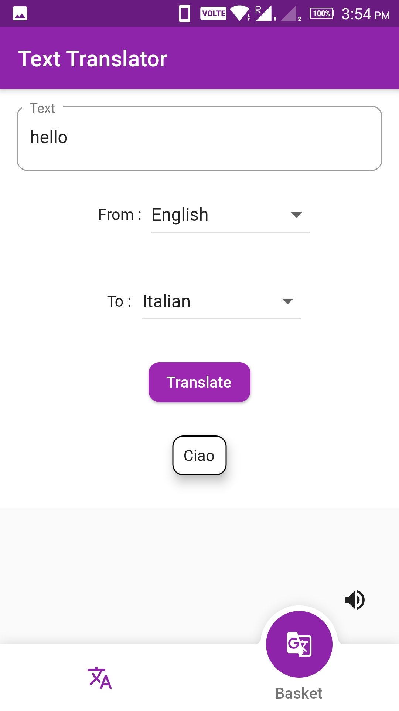

# spacer_translator

A project for Flutter International hackathon Hack19

### Feature

<ul><li>Conversion of Text from any Language to Locale Language</li></ul>

<ul><li>Conversion of Text to basket Language to basket Language</li></ul>

## What is Spacer Translator

Spacer Translator is an app for Traveler or Learner, they can translate from any language to their device Locale language as well as given set of language to given set of language. They can also listen the translated result.

## Contributing

Contributions are welcome! However, if it's going to be a major change, please create an issue first. Before starting to work on something, please comment on a specific issue and say you'd like to work on it.